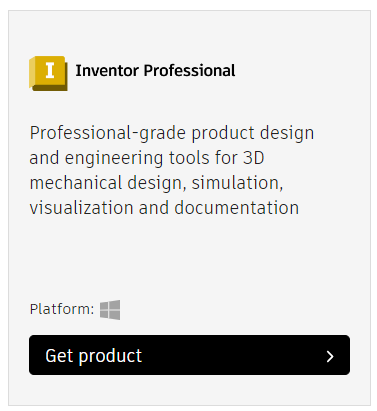

## Getting started with 3D Modeling
AMRA as an organization prioritizes learning above all else. We will try our best to host workshops through the year to teach any skills that may be needed at the time. Every student can choose to use whatever applications they choose. While ERAU teaches and educates with Catia, we at AMRA choose to use Autodesk Inventor. It comes at no cost to students and Includes a different toolbox that is more applicable in our use case. This is how you get started.

### 1. Create an Autodesk Account
If you don't have an account already create an Autodesk Account. You can do so by clicking [here](https://accounts.autodesk.com/register) and following the steps on screen. To make the liscencing process easier you should use you university provided email in ERAU's case ```myname@my.erau.edu```

### 2. Activate Education Status
In order to download any Autodesk product offered for students or educators you must first activate your education status on with Autodesk. To do so click [here](https://www.autodesk.com/education/edu-software/overview?sorting=featured&filters=individual). Sign in again if needed then you should a black box in the center of your screen label ```Create Account``` or ```Request Educational Access```. Click on this and fill out all of the information

### 3. Request and Download Products
Once all the above steps have been successfully completed you will have access to an extensive suite of CAD modeling tools. For our case we should only need to download Inventor at this time. Scroll down until you see Autodesk Inventor. 

 

You can simply hit ```Get Product``` and then ```Install``` button on the next prompt, you can most likely get the latest version without needing to worry. Follow the instructions once you've downloaded and you'll be on your way!