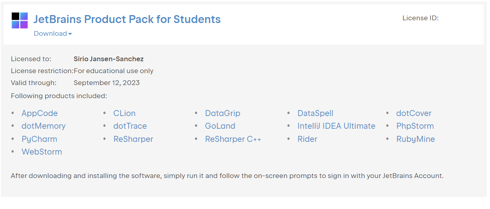

import Tabs from '@theme/Tabs';
import TabItem from '@theme/TabItem';
import Windows from './../../../docs_extended/programming/install/windows.md'
import Ubuntu from './../../../docs_extended/programming/install/ubuntu.md'
import Macos from './../../../docs_extended/programming/install/macos.md'

## Python Environments
The majority of programs written in AMRA are written in Python. This is mostly due to the flexibility with we have with Python. We do also program in [C++](www.google.com), and script in [bash](www.google.com). Typically those other languages are used for automating tasks or for interfacing with sensors. In our case, Python typically does more of the heavy carrying when it comes to computational algorithms of any kind. When programming in python and dealing with frameworks, such as TensorFlow, that require specific versions of libraries to run correctly. It is often easier to create a virtual environment and install all the correct versions just once leaving whatever libraries may be being used by other programs alone. This environment can then be activated or even deployed wherever we want to put or need to execute our program.
At AMRA we prefer to use PyCharm. Mostly because of the vast variety of tools incorporated straight into the IDE from the factory; but also because of the free educational license that we can get allowing us to use all these enterprise-level tools for free.

### Objectives
This guide will walk you through the necessary steps to install Python and all the necessary *sub*components. At the end of this guide you should be able to:
- call `python`, `python3`, `pip`, and `pip3` from the command line of any terminal
- create virtual python environments with relative ease
- "compile" a python package into an executable

# Installation Steps
Let's get started

## 1. Create a JetBrain Account
In order to activate the enterprise edition of PyCharm we have to create a JetBrains account. 

### 1. Create Normal Account
You can get to the JetBrains account creation website through [here](https://account.jetbrains.com/login). Enter your email then check your inbox. This email could be either in your spam or junk folder as well. 

### 2. Activate Student Account
Once you enter your name, email, and password, you should be greeted with a page that say something along the lines of `No Available Licenses` in the middle of the page. There should also be a link that says [Apply for a free student or teacher license](https://www.jetbrains.com/shop/eform/students). 
Click the link on that page or the one before this sentence and you should be redirected to the form. Fill the form out and be sure to use your school email as it will make the verificaton process easier. 

### 3. Activation Confirmation
Once your account has been created and your student accoutn activated you should say something similar to this: 

### *Success!!*

## 2. Install PyCharm
<Tabs groupId="os">
    <TabItem value="win" label="Windows" default>
        <Windows />
    </TabItem>
    <TabItem value="macOS" label="Mac OS" default>
        <Macos />
    </TabItem>
    <TabItem value="ubuntu" label="Ubuntu" default>
        <Ubuntu />
    </TabItem>
</Tabs>

# 3. Configuration 

